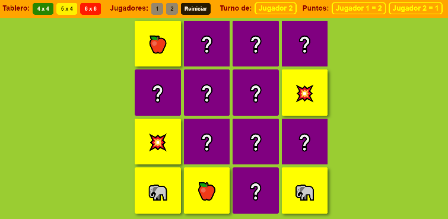

# UNQ UIs - Memotest by GMAUGE

El clásico juego de memoria para jugarlo solo o de a dos jugadores.

## Instrucciones para su instalación

Para poder jugar éste juego debes tener instalado previamnete NodeJS y React JS. Acá te indico cómo hacerlo.

>1) Instalar NodeJS: para eso debes descargar el programa desde [AQUI](https://nodejs.org/en/download/), segun el sistema operativo que uses, y segui las indicaciones para instalarlo.
>2) Descarga éste proycto GIT y descomprimilo en una carpeta, por ej.: c:\memotest.
>3) Abri una ventana de consola (por Ej. en Windows: Buscar -> cmd).
>4) Posicionate en la carperta donde descargaste el juego (según el ejemplo: c:\memotest).
>5) Ejecuta el comando "npx install" para instalar React JS. (esto puede demorar unos minutos)
>6) Para iniciar el juego ejecuta el comendo "npm star" en la misma ventana de la consola. Luego de unos segundos se abrira en tu navegador predeterminado el juego.

Que lo disfrutes!!!